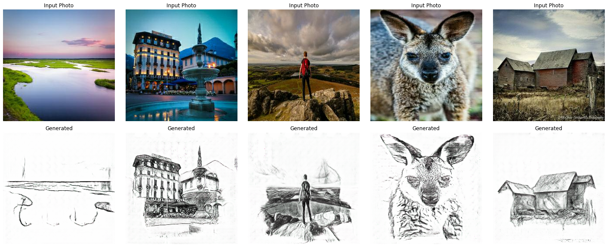

# Photo-to-Drawing Style Transfer

The goal of this project is to generate drawings/sketches from photos. This type of task is often called style transfer and popular approach for this task is to use GANs ([review](https://arxiv.org/abs/1705.04058)). This project uses CycleGAN architecture.

## Report

This project was created for the NI-MVI subject at FIT CTU. The semestral work is described in [report](report.pdf).

## Source code

The source code is avaliable as [Kaggle notebook](https://www.kaggle.com/davidmasek/public-photo-to-drawing-style-transfer).
